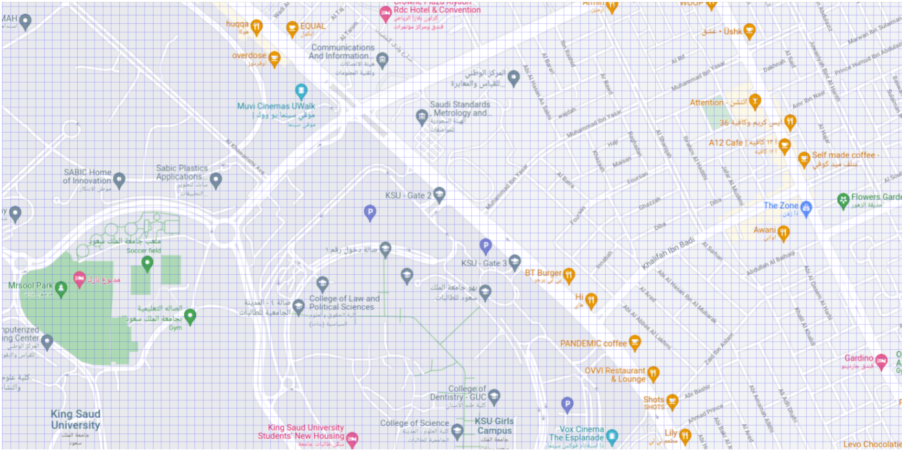

# Efficient Storage of Vehicle Locations for Vehicle Hiring Applications
 
<!-- introduction -->
## About The Project
### Introduction
Vehicle hiring companies such as Uber, Careem, and Jeeny rely on fast localization of available vehicles near potential customers. Such efficient localization requires specialized data structures, and the goal of this project is to implement and use one such data structure
### Storing vehicles locations
Vehicles and customers are localized using GPS devices available in mobile phones, and these devices determine
the longitude and latitude coordinates as floating-point numbers. To simplify the task, however, we will divide the
geographical area under consideration into small cells and use integers to identify each location on the map (see Figure
1).

Figure 1: The city is divided into small cells so that a location is identified by two integer coordinates x and y. Note
that a single cell may contain several vehicles and customers.
When a customer request a ride, only vehicles within a certain range of this customer will be contacted (see Figure
2).

Figure 2: Only vehicles lying within a square of side 2r centered at the customer are contacted (shown in green).
To store locations for efficient search, we use a tree structure similar to a BST. In addition to data, each node of
this tree contains a location (u, v) and has up to four children (see Figure 3):
• The nodes in the sub-tree rooted at Child 1 (shown in red in Figure 3) contain locations (x, y) satisfying: x < u
and y ≤ v.
• The nodes in the sub-tree rooted at Child 2 (shown in green in Figure 3) contain locations (x, y) satisfying:
x ≤ u and y > v.
• The nodes in the sub-tree rooted at Child 3 (shown in blue in Figure 3) contain locations (x, y) satisfying: x > u
and y ≥ v.
• The nodes in the sub-tree rooted at Child 4 (shown in yellow in Figure 3) contain locations (x, y) satisfying:
x ≥ u and y < v.

Example 1. If we insert the following data at the specified locations in an empty tree:
F → (4, 7)
V → (5, 7)
K → (6, 1)
D → (4, 3)
O → (4, 8)
U → (8, 4)
V → (8, 2)
Y → (2, 2)
S → (6, 1)
B → (6, 3)
then, we obtain the tree shown in Figure 4

<!-- technology -->
## Bulit With:

